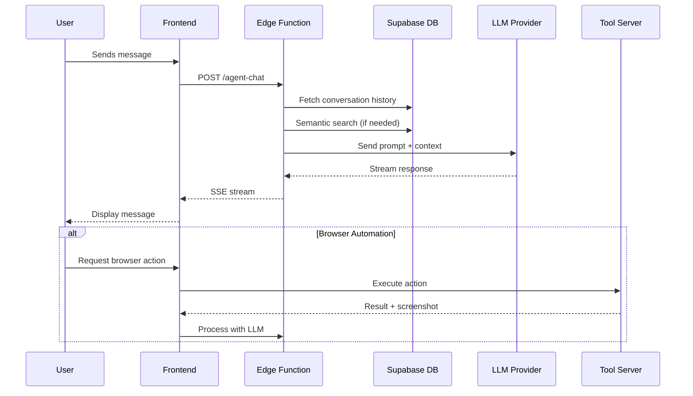
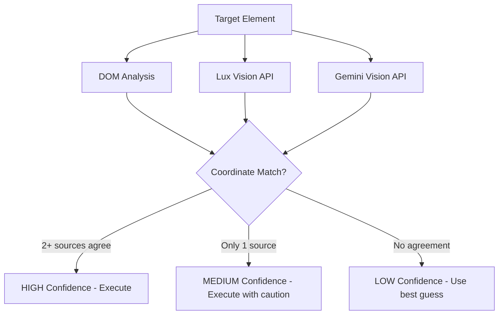
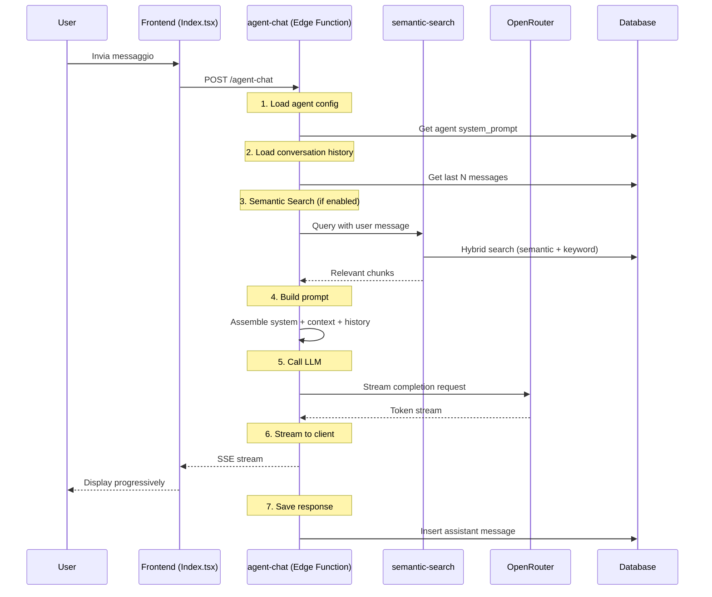
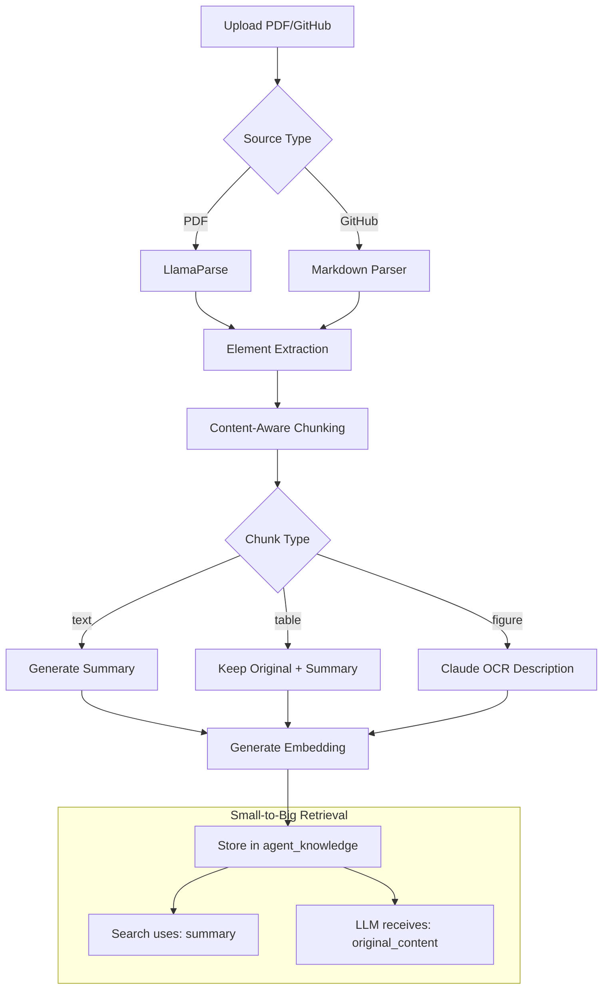
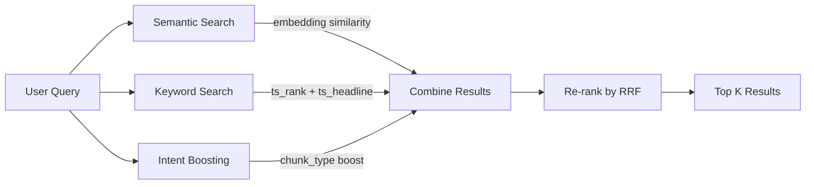
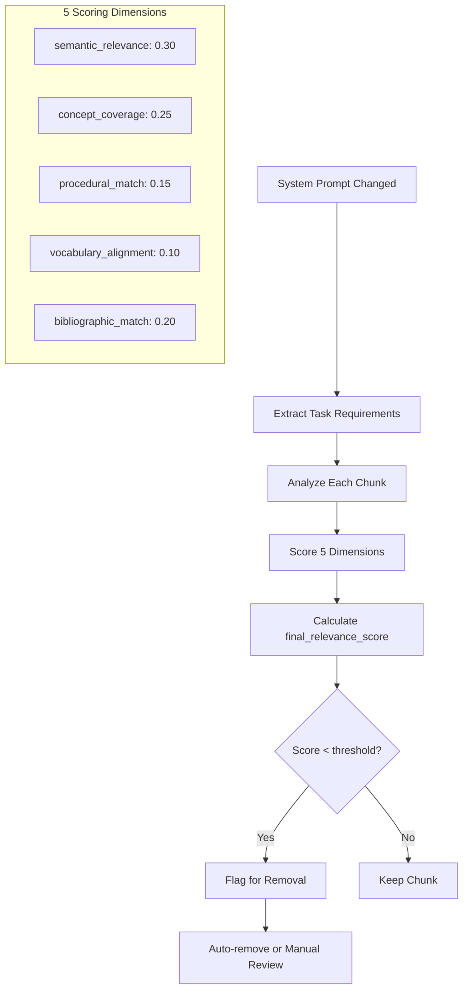
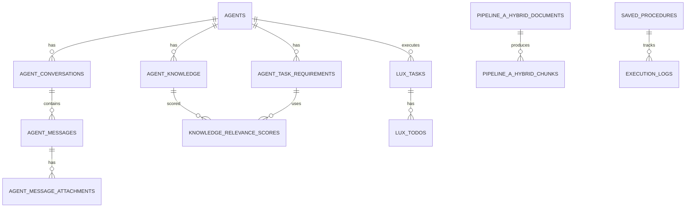

# 🚀 DEVELOPER GUIDE - RAG Multi-Agent Platform con Browser Automation

> **Versione**: 10.2.0  
> **Ultimo aggiornamento**: Gennaio 2025  
> **Stack**: React + TypeScript + Supabase + Edge Functions

---

## 📋 Indice

1. [Introduzione e Overview](#1-introduzione-e-overview)
2. [Architettura del Sistema](#2-architettura-del-sistema)
3. [Browser Automation System (Tool Server)](#3-browser-automation-system-tool-server)
4. [Sistema Agenti e Chat](#4-sistema-agenti-e-chat)
5. [Pipeline di Ingestion Documenti](#5-pipeline-di-ingestion-documenti)
6. [Semantic Search System](#6-semantic-search-system)
7. [Knowledge Alignment System](#7-knowledge-alignment-system)
8. [Schema Database Completo](#8-schema-database-completo)
9. [Edge Functions Reference](#9-edge-functions-reference)
10. [Configurazione e Secrets](#10-configurazione-e-secrets)
11. [Guida allo Sviluppo](#11-guida-allo-sviluppo)
12. [Troubleshooting](#12-troubleshooting)

---

## 1. Introduzione e Overview

### 1.1 Cos'è questo progetto?

Questa è una piattaforma **RAG (Retrieval-Augmented Generation) Multi-Agente** con capacità di **Browser Automation**. Il sistema permette di:

- 🤖 **Creare agenti AI specializzati** con knowledge base personalizzate
- 📄 **Ingestire documenti** (PDF, GitHub repos, Markdown) in chunk vettoriali
- 🔍 **Ricerca semantica ibrida** (embedding + keyword + intent boosting)
- 🌐 **Automazione browser** tramite Tool Server locale + ngrok
- 🎯 **Knowledge Alignment** automatico per mantenere la qualità della knowledge base
- 💬 **Chat multi-turno** con streaming SSE e context management

### 1.2 Stack Tecnologico

| Layer | Tecnologia |
|-------|------------|
| **Frontend** | React 18, TypeScript, Vite, Tailwind CSS, shadcn/ui |
| **State Management** | TanStack Query (React Query) |
| **Backend** | Supabase Edge Functions (Deno) |
| **Database** | PostgreSQL (Supabase) con pgvector |
| **AI/LLM** | OpenRouter (multi-provider), Lovable AI Gateway |
| **Document Parsing** | LlamaParse, Claude Vision OCR |
| **Browser Automation** | Tool Server Python + Lux API |
| **Realtime** | Supabase Realtime (WebSocket) |

### 1.3 Flusso di Alto Livello

```
┌─────────────────────────────────────────────────────────────────────────────┐
│                              FRONTEND (React)                               │
│  ┌─────────────┐  ┌─────────────┐  ┌─────────────┐  ┌─────────────────────┐ │
│  │ Chat UI     │  │ Doc Pool    │  │ Admin Panel │  │ Browser Automation  │ │
│  │ (Index.tsx) │  │ (Pool.tsx)  │  │ (Admin.tsx) │  │ (MultiAgentConsult) │ │
│  └──────┬──────┘  └──────┬──────┘  └──────┬──────┘  └──────────┬──────────┘ │
└─────────┼────────────────┼────────────────┼─────────────────────┼───────────┘
          │                │                │                     │
          ▼                ▼                ▼                     ▼
┌─────────────────────────────────────────────────────────────────────────────┐
│                         EDGE FUNCTIONS (Deno)                               │
│  ┌─────────────┐  ┌─────────────┐  ┌─────────────┐  ┌─────────────────────┐ │
│  │ agent-chat  │  │ pipeline-*  │  │ alignment-* │  │ tool-server-llm     │ │
│  │ semantic-   │  │ ingest-*    │  │ gap-analysis│  │ tool-server-vision  │ │
│  │ search      │  │ process-*   │  │             │  │ tool-server-pair    │ │
│  └──────┬──────┘  └──────┬──────┘  └──────┬──────┘  └──────────┬──────────┘ │
└─────────┼────────────────┼────────────────┼─────────────────────┼───────────┘
          │                │                │                     │
          ▼                ▼                ▼                     ▼
┌─────────────────────────────────────────────────────────────────────────────┐
│                         SUPABASE (PostgreSQL + pgvector)                    │
│  ┌─────────────┐  ┌─────────────┐  ┌─────────────┐  ┌─────────────────────┐ │
│  │ agents      │  │ pipeline_*  │  │ alignment_* │  │ tool_server_config  │ │
│  │ agent_      │  │ _documents  │  │ _analysis   │  │ saved_procedures    │ │
│  │ knowledge   │  │ _chunks     │  │ _scores     │  │ execution_logs      │ │
│  └─────────────┘  └─────────────┘  └─────────────┘  └─────────────────────┘ │
└─────────────────────────────────────────────────────────────────────────────┘
          │                                                       │
          ▼                                                       ▼
┌─────────────────────┐                           ┌───────────────────────────┐
│   EXTERNAL APIs     │                           │   TOOL SERVER (Python)    │
│  ┌───────────────┐  │                           │  ┌─────────────────────┐  │
│  │ OpenRouter    │  │                           │  │ Flask + Playwright  │  │
│  │ LlamaParse    │  │                           │  │ ngrok tunnel        │  │
│  │ Claude/Gemini │  │                           │  │ Lux API integration │  │
│  └───────────────┘  │                           │  └─────────────────────┘  │
└─────────────────────┘                           └───────────────────────────┘
```

---

## 2. Architettura del Sistema

### 2.1 Struttura Directory

```
project-root/
├── src/
│   ├── components/           # Componenti React
│   │   ├── ui/              # shadcn/ui components
│   │   ├── ChatMessage.tsx  # Rendering messaggi chat
│   │   ├── ChatInput.tsx    # Input con voice support
│   │   ├── OrchestratorPanel.tsx  # UI Browser Automation
│   │   └── ...
│   ├── pages/               # Route pages
│   │   ├── Index.tsx        # Main chat interface
│   │   ├── Admin.tsx        # Admin panel
│   │   ├── DocumentPool.tsx # Document management
│   │   └── MultiAgentConsultant.tsx  # Browser automation
│   ├── hooks/               # Custom React hooks
│   │   ├── useAuth.tsx      # Authentication
│   │   ├── useToolServerAgent.ts  # Browser automation hook
│   │   └── useKnowledgeAlignment.tsx
│   ├── lib/
│   │   ├── tool-server/     # Tool Server client library
│   │   │   ├── client.ts    # HTTP client for Tool Server
│   │   │   ├── orchestrator.ts  # Task orchestration
│   │   │   ├── coordinates.ts   # Coordinate conversion
│   │   │   └── triple-verify.ts # Verification system
│   │   └── desktop-automation/  # Desktop automation (Lux)
│   ├── contexts/            # React contexts
│   └── integrations/
│       └── supabase/
│           ├── client.ts    # Supabase client (auto-generated)
│           └── types.ts     # Database types (auto-generated)
├── supabase/
│   ├── functions/           # Edge Functions
│   │   ├── agent-chat/      # Main chat endpoint
│   │   ├── semantic-search/ # Hybrid search
│   │   ├── pipeline-a-*/    # Document ingestion
│   │   ├── tool-server-*/   # Browser automation
│   │   └── _shared/         # Shared utilities
│   └── config.toml          # Edge functions config
├── public/
│   └── data/                # Static data files
└── *.md                     # Documentation files
```

### 2.2 Flusso Dati Principale



---

## 3. Browser Automation System (Tool Server)

### 3.1 Overview

Il sistema di Browser Automation permette agli agenti AI di controllare un browser Chrome reale sul computer dell'utente. Il setup richiede:

1. **Tool Server Python** - Server Flask locale che controlla Playwright/Chrome
2. **ngrok tunnel** - Espone il server locale a internet
3. **Pairing** - Collegamento sicuro tra web app e Tool Server

### 3.2 Architettura Tool Server

```
┌─────────────────────────────────────────────────────────────────┐
│                     WEB APP (Browser)                           │
│  ┌───────────────────────────────────────────────────────────┐  │
│  │ MultiAgentConsultant.tsx                                  │  │
│  │   └── useToolServerAgent.ts                               │  │
│  │         └── toolServerClient (src/lib/tool-server/client) │  │
│  └───────────────────────────────────────────────────────────┘  │
└─────────────────────────────────────────────────────────────────┘
                              │
                              │ HTTP (via ngrok)
                              ▼
┌─────────────────────────────────────────────────────────────────┐
│                   NGROK TUNNEL                                  │
│  https://xxxx.ngrok-free.dev  ←→  localhost:5001               │
└─────────────────────────────────────────────────────────────────┘
                              │
                              ▼
┌─────────────────────────────────────────────────────────────────┐
│                 TOOL SERVER (Python Flask)                      │
│  ┌───────────────────────────────────────────────────────────┐  │
│  │ Endpoints:                                                │  │
│  │   GET  /status          - Health check                    │  │
│  │   POST /browser/start   - Start browser session           │  │
│  │   POST /browser/stop    - Stop session                    │  │
│  │   POST /screenshot      - Capture screenshot              │  │
│  │   GET  /browser/dom/tree - Get DOM snapshot               │  │
│  │   POST /click           - Click at coordinates            │  │
│  │   POST /click_by_ref    - Click by element ref (e.g. e3)  │  │
│  │   POST /type            - Type text                       │  │
│  │   POST /scroll          - Scroll page                     │  │
│  │   POST /keypress        - Press keys                      │  │
│  │   POST /navigate        - Navigate to URL                 │  │
│  └───────────────────────────────────────────────────────────┘  │
│  ┌───────────────────────────────────────────────────────────┐  │
│  │ Playwright Browser Instance                               │  │
│  │   - Headless or headed mode                               │  │
│  │   - Viewport: 1260x700 (lux_sdk standard)                 │  │
│  │   - Auto DOM snapshot after each action                   │  │
│  └───────────────────────────────────────────────────────────┘  │
└─────────────────────────────────────────────────────────────────┘
```

### 3.3 Viewport e Sistema di Coordinate

Il sistema usa tre sistemi di coordinate:

| Sistema | Range | Uso |
|---------|-------|-----|
| **viewport** | (0-1260, 0-700) | Coordinate pixel reali del browser |
| **lux_sdk** | (0-1260, 0-700) | 1:1 con viewport (usato da Lux API) |
| **normalized** | (0-999, 0-999) | Usato da Gemini Vision, richiede conversione |

```typescript
// src/lib/tool-server/constants.ts
export const VIEWPORT = { width: 1260, height: 700 };
export const LUX_SDK = { width: 1260, height: 700 };  // 1:1 mapping
export const NORMALIZED_COORD_MAX = 999;

// Conversione normalized → viewport
export function normalizedToViewport(x: number, y: number): Coordinates {
  return {
    x: Math.round((x / NORMALIZED_COORD_MAX) * VIEWPORT.width),
    y: Math.round((y / NORMALIZED_COORD_MAX) * VIEWPORT.height)
  };
}
```

### 3.4 Triple Verification System

Per garantire click accurati, il sistema usa **3 fonti indipendenti** per verificare le coordinate:



```typescript
// src/lib/tool-server/triple-verify.ts
export interface CoordinateSources {
  dom?: { x: number; y: number; confidence: number };
  lux?: { x: number; y: number; confidence: number };
  gemini?: { x: number; y: number; confidence: number };
}

export function tripleVerify(sources: CoordinateSources): TripleVerifyResult {
  const availableSources = Object.entries(sources).filter(([_, v]) => v !== undefined);
  
  // Check for agreement (within 50px threshold)
  const THRESHOLD = 50;
  let matchingPairs = 0;
  
  for (let i = 0; i < availableSources.length; i++) {
    for (let j = i + 1; j < availableSources.length; j++) {
      const dist = distance(availableSources[i][1], availableSources[j][1]);
      if (dist <= THRESHOLD) matchingPairs++;
    }
  }
  
  // Determine confidence
  if (matchingPairs >= 2) return { confidence: 'high', ... };
  if (matchingPairs === 1) return { confidence: 'medium', ... };
  return { confidence: 'low', ... };
}
```

### 3.5 DOM Snapshot e click_by_ref

Il Tool Server v10.2.0 restituisce **automaticamente** un DOM snapshot dopo ogni azione browser:

```json
{
  "success": true,
  "snapshot": "[e0] button \"Login\" [e1] input[type=email] [e2] input[type=password]...",
  "snapshot_url": "https://example.com/page",
  "snapshot_title": "Login Page",
  "snapshot_ref_count": 45
}
```

L'agente può usare `click_by_ref` per cliccare direttamente sugli elementi:

```typescript
// Invece di usare coordinate vision:
await toolServerClient.click({ x: 340, y: 220, ... });

// Usa il ref ID dal DOM snapshot:
await toolServerClient.clickByRef({ ref: "e0", session_id: "..." });
```

### 3.6 Procedure-Based Learning

Il sistema può salvare e riutilizzare procedure:

```typescript
// Tabella: saved_procedures
interface SavedProcedure {
  id: string;
  name: string;
  description: string;
  start_url: string;
  steps: ProcedureStep[];  // JSON array
  tags: string[];
  execution_count: number;
  success_rate: number;
  last_executed_at: string;
}

// Tabella: execution_logs
interface ExecutionLog {
  execution_id: string;
  procedure_id: string | null;
  task_description: string;
  status: 'running' | 'completed' | 'failed';
  steps: StepLog[];  // JSON array
  stats: ExecutionStats;
}
```

### 3.7 File Chiave per Browser Automation

| File | Descrizione |
|------|-------------|
| `src/lib/tool-server/client.ts` | Client HTTP per comunicare con Tool Server |
| `src/lib/tool-server/orchestrator.ts` | Orchestrazione task multi-step |
| `src/lib/tool-server/coordinates.ts` | Conversione coordinate |
| `src/lib/tool-server/triple-verify.ts` | Sistema verifica coordinate |
| `src/lib/tool-server/tool-executor.ts` | Esecuzione tool (routing) |
| `src/hooks/useToolServerAgent.ts` | Hook React per browser automation |
| `src/pages/MultiAgentConsultant.tsx` | UI principale |
| `supabase/functions/tool-server-llm/` | LLM per task planning |
| `supabase/functions/tool-server-vision/` | Lux + Gemini vision APIs |
| `supabase/functions/tool-server-pair/` | Pairing Tool Server |

---

## 4. Sistema Agenti e Chat

### 4.1 Struttura Agente

Ogni agente è definito nella tabella `agents`:

```sql
CREATE TABLE agents (
  id UUID PRIMARY KEY DEFAULT gen_random_uuid(),
  name TEXT NOT NULL,
  slug TEXT UNIQUE NOT NULL,
  description TEXT NOT NULL,
  system_prompt TEXT NOT NULL,
  avatar TEXT,
  active BOOLEAN DEFAULT true,
  llm_provider TEXT DEFAULT 'openrouter',
  ai_model TEXT DEFAULT 'anthropic/claude-sonnet-4',
  user_id UUID,
  created_at TIMESTAMPTZ DEFAULT now()
);
```

### 4.2 Flusso Conversazione



### 4.3 Provider LLM Supportati

```typescript
// supabase/functions/agent-chat/index.ts
const LLM_PROVIDERS = {
  'openrouter': {
    baseUrl: 'https://openrouter.ai/api/v1',
    models: ['anthropic/claude-sonnet-4', 'openai/gpt-4o', 'google/gemini-pro']
  },
  'deepseek': {
    baseUrl: 'https://api.deepseek.com/v1',
    models: ['deepseek-chat', 'deepseek-coder']
  },
  'lovable-ai': {
    baseUrl: 'LOVABLE_AI_GATEWAY_URL',
    models: ['openai/gpt-5', 'google/gemini-2.5-flash']  // No API key needed!
  }
};
```

### 4.4 Query Decomposition

Per query complesse, il sistema può decomporre in sub-query:

```typescript
// Esempio di query decomposition
User: "Quali sono le best practices per la sicurezza JWT e come implementarle in Node.js?"

// Decomposed into:
1. "best practices sicurezza JWT"
2. "implementazione JWT Node.js"
3. "vulnerabilità comuni JWT"
```

### 4.5 File Chiave per Chat System

| File | Descrizione |
|------|-------------|
| `src/pages/Index.tsx` | Main chat page |
| `src/components/ChatMessage.tsx` | Message rendering (markdown) |
| `src/components/ChatInput.tsx` | Input con attachment support |
| `supabase/functions/agent-chat/index.ts` | Main chat endpoint (~4500 lines) |
| `supabase/functions/semantic-search/index.ts` | Hybrid search |
| `supabase/functions/expand-query-llm/index.ts` | Query expansion |

---

## 5. Pipeline di Ingestion Documenti

### 5.1 Overview Pipeline

Il sistema ha **3 pipeline parallele** per l'ingestion:

| Pipeline | Focus | Use Case |
|----------|-------|----------|
| **Pipeline A-Hybrid** | PDFs + GitHub (primaria) | Documenti tecnici, manuali |
| **Pipeline B** | Alternative processing | Backup/testing |
| **Pipeline C** | Specialized processing | Custom workflows |

### 5.2 Pipeline A-Hybrid (Principale)



### 5.3 Small-to-Big Retrieval Pattern

Principio chiave: **cercare su summary compatti, ma passare all'LLM il contenuto originale completo**.

```typescript
// supabase/functions/_shared/recursiveRetriever.ts

interface ChunkWithRecursiveRetrieval {
  id: string;
  content: string;           // Summary (for search)
  original_content?: string; // Full content (for LLM)
  similarity: number;
}

function swapSummaryWithOriginal(chunks: ChunkWithRecursiveRetrieval[]) {
  return chunks.map(chunk => ({
    ...chunk,
    content: chunk.original_content || chunk.content  // Swap!
  }));
}
```

### 5.4 Content-Aware Chunking

```typescript
// supabase/functions/_shared/contentAwareChunker.ts

interface ChunkingConfig {
  max_chunk_size: 1500,       // Max chars per chunk
  min_chunk_size: 200,        // Min chars (avoid tiny chunks)
  overlap_size: 150,          // Overlap between chunks
  respect_boundaries: true,   // Don't break sentences/paragraphs
  preserve_tables: true,      // Keep tables as single chunks
  preserve_code_blocks: true  // Keep code blocks intact
}
```

### 5.5 Visual Enrichment

Per chunk con figure/immagini, il sistema usa Claude Vision per generare descrizioni:

```typescript
// supabase/functions/_shared/visionEnhancer.ts

async function enrichChunkWithVision(chunk: Chunk, imageBase64: string) {
  const description = await claudeVisionOCR({
    image: imageBase64,
    prompt: "Describe this figure/diagram in detail for a technical document."
  });
  
  return {
    ...chunk,
    content: chunk.content + "\n\n[Figure Description]: " + description,
    chunk_type: 'figure'
  };
}
```

### 5.6 Tabelle Database per Pipeline

```sql
-- Documenti (stato processing)
CREATE TABLE pipeline_a_hybrid_documents (
  id UUID PRIMARY KEY,
  name TEXT NOT NULL,
  source_type TEXT,  -- 'pdf', 'github', 'markdown'
  status TEXT DEFAULT 'pending',  -- pending, processing, completed, failed
  storage_path TEXT,
  llamaparse_job_id TEXT,
  total_pages INTEGER,
  total_chunks INTEGER,
  error_message TEXT,
  created_at TIMESTAMPTZ DEFAULT now()
);

-- Chunks generati
CREATE TABLE pipeline_a_hybrid_chunks (
  id UUID PRIMARY KEY,
  document_id UUID REFERENCES pipeline_a_hybrid_documents,
  chunk_index INTEGER,
  chunk_type TEXT,  -- 'text', 'table', 'figure', 'code'
  content TEXT,
  original_content TEXT,  -- For small-to-big retrieval
  summary TEXT,
  embedding VECTOR(1536),
  metadata JSONB,
  created_at TIMESTAMPTZ DEFAULT now()
);
```

### 5.7 File Chiave per Pipeline

| File | Descrizione |
|------|-------------|
| `src/pages/DocumentPool.tsx` | UI gestione documenti |
| `src/components/DocumentPoolUpload.tsx` | Upload component |
| `supabase/functions/pipeline-a-hybrid-ingest-pdf/` | PDF ingestion |
| `supabase/functions/pipeline-a-hybrid-ingest-github/` | GitHub ingestion |
| `supabase/functions/pipeline-a-hybrid-process-chunks/` | Chunk processing |
| `supabase/functions/pipeline-a-hybrid-generate-embeddings/` | Embedding generation |
| `supabase/functions/_shared/llamaParseClient.ts` | LlamaParse integration |
| `supabase/functions/_shared/contentAwareChunker.ts` | Chunking logic |

---

## 6. Semantic Search System

### 6.1 True Hybrid Search

Il sistema combina **3 strategie di ricerca**:



### 6.2 Semantic Search (pgvector)

```sql
-- RPC function: match_documents
CREATE FUNCTION match_documents(
  query_embedding VECTOR(1536),
  match_threshold FLOAT DEFAULT 0.7,
  match_count INT DEFAULT 10
) RETURNS TABLE (
  id UUID,
  content TEXT,
  similarity FLOAT
) AS $$
  SELECT 
    id,
    content,
    1 - (embedding <=> query_embedding) as similarity
  FROM agent_knowledge
  WHERE 1 - (embedding <=> query_embedding) > match_threshold
  ORDER BY embedding <=> query_embedding
  LIMIT match_count;
$$ LANGUAGE sql;
```

### 6.3 Keyword Search (Full-Text)

```sql
-- RPC function: keyword_search_documents
CREATE FUNCTION keyword_search_documents(
  search_query TEXT,
  match_count INT DEFAULT 10
) RETURNS TABLE (
  id UUID,
  content TEXT,
  rank FLOAT,
  headline TEXT
) AS $$
  SELECT 
    id,
    content,
    ts_rank(to_tsvector('italian', content), plainto_tsquery('italian', search_query)) as rank,
    ts_headline('italian', content, plainto_tsquery('italian', search_query)) as headline
  FROM agent_knowledge
  WHERE to_tsvector('italian', content) @@ plainto_tsquery('italian', search_query)
  ORDER BY rank DESC
  LIMIT match_count;
$$ LANGUAGE sql;
```

### 6.4 Intent Boosting per chunk_type

```typescript
// supabase/functions/semantic-search/index.ts

const INTENT_BOOST = {
  'how_to': { 'procedural': 1.3, 'code': 1.2 },
  'what_is': { 'definition': 1.3, 'concept': 1.2 },
  'compare': { 'table': 1.4, 'comparison': 1.3 },
  'example': { 'code': 1.4, 'figure': 1.2 }
};

function applyIntentBoost(chunks: Chunk[], intent: string) {
  const boosts = INTENT_BOOST[intent] || {};
  return chunks.map(chunk => ({
    ...chunk,
    boosted_score: chunk.similarity * (boosts[chunk.chunk_type] || 1.0)
  }));
}
```

### 6.5 Reciprocal Rank Fusion (RRF)

Per combinare risultati da fonti diverse:

```typescript
function reciprocalRankFusion(
  semanticResults: Result[],
  keywordResults: Result[],
  k: number = 60
): Result[] {
  const scores = new Map<string, number>();
  
  semanticResults.forEach((r, i) => {
    const rrf = 1 / (k + i + 1);
    scores.set(r.id, (scores.get(r.id) || 0) + rrf);
  });
  
  keywordResults.forEach((r, i) => {
    const rrf = 1 / (k + i + 1);
    scores.set(r.id, (scores.get(r.id) || 0) + rrf);
  });
  
  return [...scores.entries()]
    .sort((a, b) => b[1] - a[1])
    .map(([id, score]) => ({ id, rrf_score: score }));
}
```

---

## 7. Knowledge Alignment System

### 7.1 Obiettivo

Mantenere la knowledge base **allineata** con il system prompt dell'agente, rimuovendo automaticamente chunk irrilevanti.

### 7.2 Flusso di Alignment



### 7.3 Task Requirements Extraction

```typescript
// supabase/functions/extract-task-requirements/index.ts

interface TaskRequirements {
  theoretical_concepts: string[];   // Concetti teorici richiesti
  operational_concepts: string[];   // Concetti operativi
  procedural_knowledge: string[];   // Procedure/workflow
  domain_vocabulary: string[];      // Vocabolario specifico
  bibliographic_references: {       // Riferimenti bibliografici
    authors: string[];
    works: string[];
    standards: string[];
  };
  explicit_rules: string[];         // Regole esplicite dal prompt
}
```

### 7.4 Scoring Multi-Dimensionale

```typescript
// src/config/knowledgeAlignmentConfig.ts

export const KNOWLEDGE_ALIGNMENT_CONFIG = {
  score_weights: {
    semantic_relevance: 0.30,    // Similarità semantica generale
    concept_coverage: 0.25,      // Copertura concetti teorici
    procedural_match: 0.15,      // Match procedure
    vocabulary_alignment: 0.10,  // Vocabolario di dominio
    bibliographic_match: 0.20,   // Match riferimenti
  },
  
  auto_removal: {
    enabled: true,
    threshold: 0.5,  // Remove if score < 50%
    max_removals_per_run: 50,
  }
};
```

### 7.5 Pesi Adattivi per Tipo Agente

```typescript
// src/utils/agentWeights.ts

const AGENT_TYPE_WEIGHTS = {
  'academic': {
    semantic_relevance: 0.20,
    concept_coverage: 0.25,
    procedural_match: 0.10,
    vocabulary_alignment: 0.15,
    bibliographic_match: 0.30,  // Più peso a bibliografia
  },
  'technical': {
    semantic_relevance: 0.25,
    concept_coverage: 0.20,
    procedural_match: 0.30,    // Più peso a procedure
    vocabulary_alignment: 0.15,
    bibliographic_match: 0.10,
  },
  'general': {
    // Default weights
  }
};
```

### 7.6 Gap Analysis

Identifica **lacune** nella knowledge base rispetto ai requisiti:

```typescript
interface GapAnalysisResult {
  category: 'theoretical' | 'procedural' | 'bibliographic';
  requirement: string;          // Cosa manca
  coverage_score: number;       // 0-1, quanto è coperto
  severity: 'critical' | 'moderate' | 'minor';
  suggestions: string[];        // Suggerimenti per colmare
}
```

### 7.7 Tabelle per Knowledge Alignment

```sql
-- Requisiti estratti dal prompt
CREATE TABLE agent_task_requirements (
  id UUID PRIMARY KEY,
  agent_id UUID REFERENCES agents,
  system_prompt_hash TEXT,
  theoretical_concepts TEXT[],
  operational_concepts TEXT[],
  procedural_knowledge TEXT[],
  domain_vocabulary TEXT[],
  bibliographic_references JSONB,
  explicit_rules TEXT[],
  extracted_at TIMESTAMPTZ
);

-- Score per ogni chunk
CREATE TABLE knowledge_relevance_scores (
  id UUID PRIMARY KEY,
  chunk_id UUID REFERENCES agent_knowledge,
  agent_id UUID REFERENCES agents,
  requirement_id UUID REFERENCES agent_task_requirements,
  semantic_relevance FLOAT,
  concept_coverage FLOAT,
  procedural_match FLOAT,
  vocabulary_alignment FLOAT,
  bibliographic_match FLOAT,
  final_relevance_score FLOAT,
  weights_used JSONB,
  analyzed_at TIMESTAMPTZ
);

-- Log delle rimozioni
CREATE TABLE knowledge_removal_history (
  id UUID PRIMARY KEY,
  agent_id UUID REFERENCES agents,
  chunk_id UUID,
  content TEXT,
  removal_reason TEXT,
  final_relevance_score FLOAT,
  removed_at TIMESTAMPTZ,
  restored_at TIMESTAMPTZ  -- NULL se non ripristinato
);
```

---

## 8. Schema Database Completo

### 8.1 Diagramma ER Semplificato



### 8.2 Tabelle Principali

#### Agents

```sql
CREATE TABLE agents (
  id UUID PRIMARY KEY DEFAULT gen_random_uuid(),
  name TEXT NOT NULL,
  slug TEXT UNIQUE NOT NULL,
  description TEXT NOT NULL,
  system_prompt TEXT NOT NULL,
  avatar TEXT,
  active BOOLEAN DEFAULT true,
  llm_provider TEXT DEFAULT 'openrouter',
  ai_model TEXT DEFAULT 'anthropic/claude-sonnet-4',
  user_id UUID,
  first_alignment_completed_at TIMESTAMPTZ,
  created_at TIMESTAMPTZ DEFAULT now()
);
```

#### Agent Knowledge

```sql
CREATE TABLE agent_knowledge (
  id UUID PRIMARY KEY DEFAULT gen_random_uuid(),
  agent_id UUID REFERENCES agents,
  document_name TEXT NOT NULL,
  category TEXT NOT NULL,
  chunk_type TEXT,  -- 'text', 'table', 'figure', 'code'
  content TEXT NOT NULL,
  summary TEXT,
  embedding VECTOR(1536),
  chunking_metadata JSONB,
  pool_document_id UUID,
  is_active BOOLEAN DEFAULT true,
  removed_at TIMESTAMPTZ,
  removal_reason TEXT,
  created_at TIMESTAMPTZ DEFAULT now()
);

-- Indice per ricerca vettoriale
CREATE INDEX idx_agent_knowledge_embedding 
  ON agent_knowledge USING ivfflat (embedding vector_cosine_ops)
  WITH (lists = 100);
```

#### Conversations & Messages

```sql
CREATE TABLE agent_conversations (
  id UUID PRIMARY KEY DEFAULT gen_random_uuid(),
  agent_id UUID REFERENCES agents NOT NULL,
  user_id UUID NOT NULL,
  title TEXT,
  workflow_updated_at TIMESTAMPTZ,
  waiting_for_confirmation BOOLEAN DEFAULT false,
  last_proposed_query TEXT,
  created_at TIMESTAMPTZ DEFAULT now(),
  updated_at TIMESTAMPTZ DEFAULT now()
);

CREATE TABLE agent_messages (
  id UUID PRIMARY KEY DEFAULT gen_random_uuid(),
  conversation_id UUID REFERENCES agent_conversations NOT NULL,
  role TEXT NOT NULL,  -- 'user', 'assistant', 'system', 'tool'
  content TEXT NOT NULL,
  llm_provider TEXT,
  metadata JSONB,
  created_at TIMESTAMPTZ DEFAULT now()
);
```

#### Tool Server Config

```sql
CREATE TABLE tool_server_config (
  id UUID PRIMARY KEY DEFAULT gen_random_uuid(),
  user_id UUID NOT NULL,
  ngrok_url TEXT NOT NULL,
  device_name TEXT,
  device_secret TEXT NOT NULL,  -- Per validare update URL
  is_active BOOLEAN DEFAULT true,
  last_seen_at TIMESTAMPTZ,
  created_at TIMESTAMPTZ DEFAULT now()
);

CREATE TABLE saved_procedures (
  id UUID PRIMARY KEY DEFAULT gen_random_uuid(),
  user_id UUID,
  name TEXT NOT NULL,
  description TEXT,
  start_url TEXT,
  steps JSONB NOT NULL,  -- Array di ProcedureStep
  tags TEXT[],
  execution_count INTEGER DEFAULT 0,
  success_rate FLOAT DEFAULT 0,
  is_template BOOLEAN DEFAULT false,
  last_executed_at TIMESTAMPTZ,
  created_at TIMESTAMPTZ DEFAULT now()
);

CREATE TABLE execution_logs (
  execution_id TEXT PRIMARY KEY,
  procedure_id UUID REFERENCES saved_procedures,
  user_id UUID,
  task_description TEXT NOT NULL,
  mode TEXT NOT NULL,
  status TEXT DEFAULT 'running',
  steps JSONB DEFAULT '[]',
  stats JSONB DEFAULT '{}',
  environment JSONB DEFAULT '{}',
  started_at TIMESTAMPTZ DEFAULT now(),
  completed_at TIMESTAMPTZ
);
```

#### Lux Tasks (Desktop Automation)

```sql
CREATE TABLE lux_tasks (
  id UUID PRIMARY KEY DEFAULT gen_random_uuid(),
  user_id UUID,
  agent_id UUID REFERENCES agents,
  conversation_id UUID,
  task_description TEXT NOT NULL,
  user_request TEXT NOT NULL,
  lux_mode TEXT,  -- 'actor', 'thinker', 'tasker'
  lux_model TEXT,
  status TEXT DEFAULT 'pending',
  progress INTEGER DEFAULT 0,
  result TEXT,
  error_message TEXT,
  execution_summary JSONB,
  start_url TEXT,
  headless BOOLEAN DEFAULT false,
  temperature FLOAT,
  max_steps_per_todo INTEGER,
  started_at TIMESTAMPTZ,
  completed_at TIMESTAMPTZ,
  created_at TIMESTAMPTZ DEFAULT now()
);

CREATE TABLE lux_todos (
  id UUID PRIMARY KEY DEFAULT gen_random_uuid(),
  task_id UUID REFERENCES lux_tasks,
  todo_index INTEGER NOT NULL,
  todo_description TEXT NOT NULL,
  status TEXT DEFAULT 'pending',
  lux_actions JSONB,  -- Array di LuxAction
  lux_feedback JSONB,
  screenshot_before TEXT,
  screenshot_after TEXT,
  started_at TIMESTAMPTZ,
  completed_at TIMESTAMPTZ
);
```

---

## 9. Edge Functions Reference

### 9.1 Categorizzazione

| Categoria | Functions | Trigger |
|-----------|-----------|---------|
| **Chat** | `agent-chat`, `deepseek-chat`, `openrouter-chat` | HTTP |
| **Search** | `semantic-search`, `expand-query-llm`, `suggest-next-query` | HTTP |
| **Pipeline A** | `pipeline-a-hybrid-ingest-*`, `pipeline-a-hybrid-process-*` | HTTP |
| **Pipeline B/C** | `pipeline-b-*`, `pipeline-c-*` | HTTP |
| **Alignment** | `analyze-knowledge-alignment`, `extract-task-requirements`, `detailed-gap-analysis` | HTTP |
| **Tool Server** | `tool-server-llm`, `tool-server-vision`, `tool-server-pair` | HTTP |
| **Utility** | `text-to-speech`, `transcribe-audio`, `ocr-image` | HTTP |
| **Maintenance** | `cleanup-*`, `recover-*` | CRON |
| **Queue** | `process-pdf-queue`, `process-github-jobs-queue` | CRON |

### 9.2 Dettaglio Functions Principali

#### agent-chat

```typescript
// POST /functions/v1/agent-chat
// Main chat endpoint (~4500 lines)

interface AgentChatRequest {
  agentId: string;
  conversationId: string;
  userMessage: string;
  attachments?: Attachment[];
  toolServerResult?: ToolServerResultPayload;  // Per browser automation
  options?: {
    skipSemanticSearch?: boolean;
    streamResponse?: boolean;
  };
}

// Features:
// - Streaming SSE response
// - Semantic search integration
// - Tool Server result injection
// - Query decomposition
// - Multi-provider LLM support
```

#### semantic-search

```typescript
// POST /functions/v1/semantic-search

interface SemanticSearchRequest {
  query: string;
  agentId: string;
  limit?: number;
  threshold?: number;
  includeKeywordSearch?: boolean;
  intentBoost?: boolean;
}

interface SemanticSearchResponse {
  chunks: Array<{
    id: string;
    content: string;
    similarity: number;
    chunk_type: string;
    document_name: string;
  }>;
  searchMetadata: {
    semantic_count: number;
    keyword_count: number;
    rrf_applied: boolean;
  };
}
```

#### tool-server-llm

```typescript
// POST /functions/v1/tool-server-llm

interface ToolServerLLMRequest {
  task: string;
  conversationHistory: Message[];
  availableTools: ToolDefinition[];
  screenshot?: string;  // Base64
  domSnapshot?: string;
}

// Returns next action to execute
interface ToolServerLLMResponse {
  toolUse?: {
    name: string;
    input: Record<string, unknown>;
  };
  textResponse?: string;
  isComplete?: boolean;
}
```

### 9.3 Shared Utilities (_shared/)

| File | Scopo |
|------|-------|
| `logger.ts` | Logging strutturato per edge functions |
| `llamaParseClient.ts` | Client per LlamaParse API |
| `claudeVisionOCR.ts` | OCR con Claude Vision |
| `embeddingService.ts` | Generazione embeddings |
| `contentAwareChunker.ts` | Chunking intelligente |
| `recursiveRetriever.ts` | Small-to-Big retrieval |
| `metadataExtractor.ts` | Estrazione metadati documenti |

---

## 10. Configurazione e Secrets

### 10.1 Environment Variables (.env)

```bash
# Auto-generated by Supabase
VITE_SUPABASE_URL=https://xxx.supabase.co
VITE_SUPABASE_PUBLISHABLE_KEY=eyJ...
VITE_SUPABASE_PROJECT_ID=xxx

# Non modificare manualmente!
```

### 10.2 Secrets (Edge Functions)

Configurati tramite Supabase Dashboard o Lovable Cloud:

| Secret | Uso |
|--------|-----|
| `OPENROUTER_API_KEY` | LLM provider principale |
| `DEEPSEEK_API_KEY` | DeepSeek models |
| `LLAMA_CLOUD_API_KEY` | LlamaParse per PDF |
| `ANTHROPIC_API_KEY` | Claude Vision OCR |
| `GOOGLE_AI_STUDIO_API_KEY` | Gemini Vision |
| `LUX_API_KEY` | Lux Vision API |
| `ELEVENLABS_API_KEY` | Text-to-Speech |
| `OPENAI_API_KEY` | Embeddings + GPT |

### 10.3 CRON Jobs

```toml
# supabase/config.toml

[functions.process-pdf-queue]
schedule = "*/5 * * * *"  # Every 5 minutes

[functions.process-github-jobs-queue]
schedule = "*/5 * * * *"

[functions.cleanup-orphan-storage-file]
schedule = "0 3 * * *"  # Daily at 3 AM
```

---

## 11. Guida allo Sviluppo

### 11.1 Aggiungere un Nuovo Agente

1. **Via UI (Admin Panel)**:
   - Vai a `/admin`
   - Click "Create Agent"
   - Compila nome, descrizione, system prompt
   - Seleziona LLM provider e modello

2. **Via Database**:
```sql
INSERT INTO agents (name, slug, description, system_prompt, llm_provider, ai_model)
VALUES (
  'My New Agent',
  'my-new-agent',
  'Description here',
  'You are a helpful assistant that...',
  'openrouter',
  'anthropic/claude-sonnet-4'
);
```

### 11.2 Estendere il Tool Server

Per aggiungere un nuovo comando browser:

1. **Tool Server (Python)**: Aggiungi endpoint in Flask
2. **client.ts**: Aggiungi metodo nel `ToolServerClient`
3. **tool-executor.ts**: Aggiungi case nel routing
4. **types.ts**: Aggiungi tipi TypeScript

```typescript
// Esempio: Aggiungere comando "highlight"

// 1. client.ts
async highlight(options: { selector: string; session_id: string }) {
  return this.post('/highlight', options);
}

// 2. tool-executor.ts
case 'highlight':
  result = await toolServerClient.highlight({
    selector: input.selector,
    session_id: sessionId
  });
  break;
```

### 11.3 Creare una Nuova Edge Function

```bash
# 1. Crea la directory
mkdir supabase/functions/my-new-function

# 2. Crea index.ts
touch supabase/functions/my-new-function/index.ts
```

```typescript
// supabase/functions/my-new-function/index.ts
import { serve } from "https://deno.land/std@0.168.0/http/server.ts";

const corsHeaders = {
  'Access-Control-Allow-Origin': '*',
  'Access-Control-Allow-Headers': 'authorization, x-client-info, apikey, content-type',
};

serve(async (req) => {
  if (req.method === 'OPTIONS') {
    return new Response(null, { headers: corsHeaders });
  }

  try {
    const { param1, param2 } = await req.json();
    
    // Your logic here
    
    return new Response(
      JSON.stringify({ success: true, data: result }),
      { headers: { ...corsHeaders, 'Content-Type': 'application/json' } }
    );
  } catch (error) {
    return new Response(
      JSON.stringify({ error: error.message }),
      { status: 500, headers: { ...corsHeaders, 'Content-Type': 'application/json' } }
    );
  }
});
```

```toml
# Aggiungi a supabase/config.toml
[functions.my-new-function]
verify_jwt = false
```

### 11.4 Debugging

#### Console Logs (Frontend)
```typescript
// Usa il logger strutturato
import { logger } from '@/lib/logger';

logger.info('Operation started', { agentId, action });
logger.error('Operation failed', { error: e.message });
```

#### Edge Function Logs
```typescript
// In edge functions, usa console con prefissi
console.log('[my-function] Processing request', { requestId });
console.error('[my-function] Error:', error);
```

#### Tool Server
- Controlla `MultiAgentConsultant.tsx` per log in console
- Controlla la risposta HTTP del Tool Server
- Usa `/status` endpoint per health check

---

## 12. Troubleshooting

### 12.1 Tool Server Non Risponde

1. **Verifica Tool Server locale**: `curl http://localhost:5001/status`
2. **Verifica ngrok**: `curl https://xxx.ngrok-free.dev/status`
3. **Verifica pairing**: Controlla `tool_server_config` nel DB
4. **Rigenera pairing**: Disconnetti e ricollega

### 12.2 Semantic Search Non Trova Risultati

1. **Verifica embeddings**: `SELECT COUNT(*) FROM agent_knowledge WHERE embedding IS NOT NULL`
2. **Abbassa threshold**: Prova `threshold: 0.5` invece di `0.7`
3. **Controlla agent_id**: Assicurati che i chunk siano assegnati all'agente giusto
4. **Rigenera embeddings**: Usa edge function `regenerate-table-embeddings`

### 12.3 Pipeline Ingestion Bloccata

1. **Controlla status**: `SELECT * FROM pipeline_a_hybrid_documents WHERE status = 'processing'`
2. **Controlla errori**: `SELECT * FROM pipeline_a_hybrid_documents WHERE status = 'failed'`
3. **Verifica LlamaParse credits**: `check-llamaparse-credits` edge function
4. **Reset manuale**: Cambia status a `pending` e ri-triggera

### 12.4 Chat Non Risponde

1. **Controlla API key**: Verifica `OPENROUTER_API_KEY` nei secrets
2. **Controlla logs**: Edge function `agent-chat` logs
3. **Verifica agent**: `SELECT * FROM agents WHERE id = 'xxx'`
4. **Testa streaming**: Prova con `streamResponse: false`

---

## Appendice A: Glossario

| Termine | Definizione |
|---------|-------------|
| **Chunk** | Frammento di documento con embedding vettoriale |
| **RAG** | Retrieval-Augmented Generation |
| **RRF** | Reciprocal Rank Fusion (algoritmo di ranking) |
| **SSE** | Server-Sent Events (streaming) |
| **Tool Server** | Server Python locale per browser automation |
| **Triple Verify** | Sistema 3 fonti per verifica coordinate |
| **Small-to-Big** | Pattern: cerca su summary, usa originale |

---

## Appendice B: Links Utili

- **Supabase Docs**: https://supabase.com/docs
- **pgvector**: https://github.com/pgvector/pgvector
- **LlamaParse**: https://docs.llamaindex.ai/en/stable/llama_cloud/llama_parse/
- **OpenRouter**: https://openrouter.ai/docs
- **Lux API**: (internal documentation)

---

*Documento generato automaticamente. Per contribuire, apri una PR con le modifiche.*
